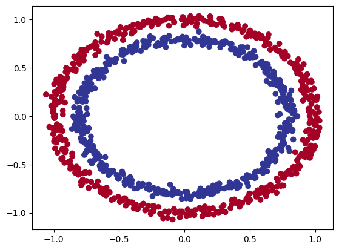
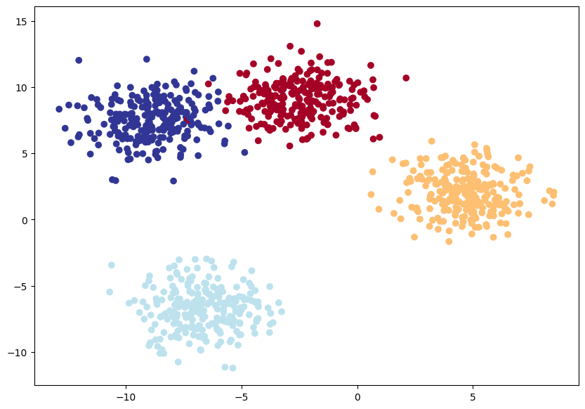
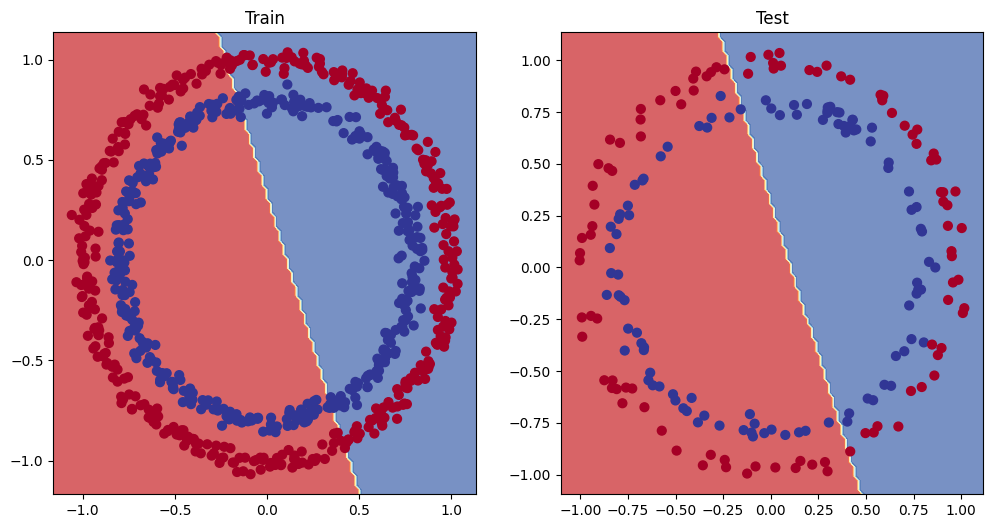
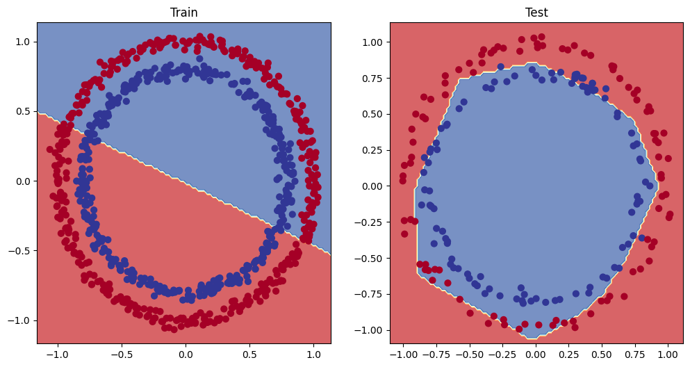
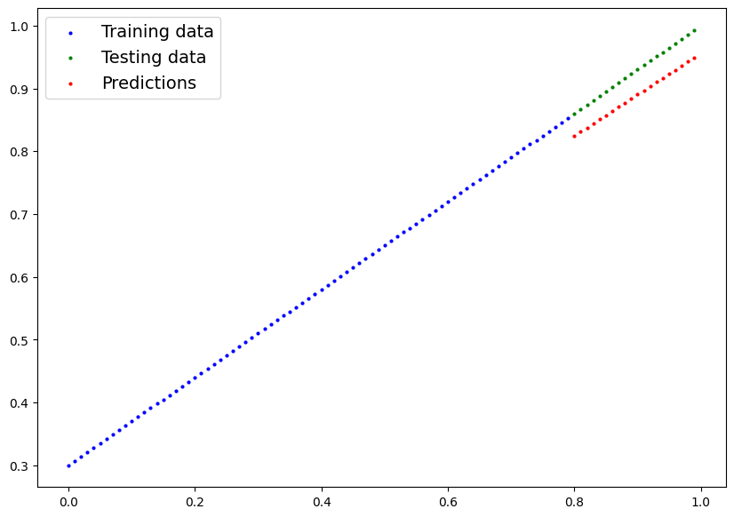

# PyTorch Neural Network Classification

This repository contains my exploration of neural network classification with PyTorch. It documents my learning journey implementing various classification models, from simple to complex architectures.

## Implementation Details

- Implementation uses both PyTorch's nn.Module (subclassing) and nn.Sequential (chainable) approaches
- Binary classification implemented with sigmoid activation and BCEWithLogitsLoss
- Multi-class classification uses softmax activation with CrossEntropyLoss
- Non-linear activation functions (ReLU) demonstrate their necessity for complex pattern recognition
- Testing utilizes scikit-learn's datasets (make_circles, make_blobs) for different classification scenarios
- Visualization of decision boundaries provides insight into model performance
- Standard PyTorch training loop implemented: forward → loss → zero_grad → backward → step
- Demonstrates why linear models can fit regression data but fail on non-linear classification tasks

## Code Organization

- `binary_classification.py`: Models for the circles dataset - shows why non-linearity matters
- `regression_validation.py`: Simple regression test to sanity-check model architecture
- `multiclass_classification.py`: Blob dataset classification with multiple classes
- `helper_functions.py`: Visualization tools I'm borrowing from the PyTorch course
- `run_all.py`: Quick script to run everything in sequence

## Key Takeaways

### Non-linearity in Neural Networks

Models without ReLU activations couldn't learn the circular decision boundary. Adding ReLU allowed the model to successfully solve the problem. This demonstrates why deep learning requires non-linear activation functions.

### Model Progression

Started simple and built up complexity:
1. Basic model → failed on circles
2. Added more layers → still failed (just a stack of linear transforms)
3. Added non-linear ReLU → worked effectively
4. Extended to multi-class → worked with same pattern

## Results Visualization

### Dataset Visualization
The experiments use two main datasets:


*Binary classification dataset created with scikit-learn's make_circles function. The task is to separate the inner blue points from the outer red points with a decision boundary.*


*Multi-class classification dataset with four distinct clusters created using make_blobs.*

### Model Performance

#### Binary Classification Results
The impact of non-linearity is clearly demonstrated in the decision boundaries:


*Model without non-linearity fails - it can only create a linear decision boundary*


*Model with ReLU activation functions successfully captures the circular decision boundary*

#### Linear Regression Validation
Testing models on simple linear regression problems helps validate the architecture:


*The same neural network architecture can successfully fit linear data*

## Technologies Used

- PyTorch
- scikit-learn
- Matplotlib
- NumPy
- Pandas

## Requirements

```
torch>=2.0.0
scikit-learn>=1.0.0
matplotlib>=3.5.0
numpy>=1.20.0
pandas>=1.3.0
```

## Running the Code

Run everything at once:
```bash
python run_all.py
```

Or run individual experiments:
```bash
python binary_classification.py  # Shows the power of non-linearity
python regression_validation.py  # Confirms model can fit a straight line
python multiclass_classification.py  # Handles multiple classes
```

Look for the generated PNG files to see visualizations of decision boundaries and learning curves.
